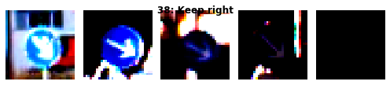
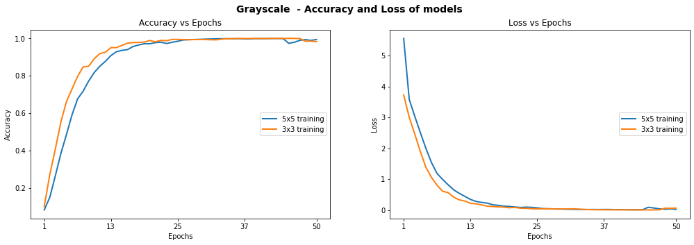
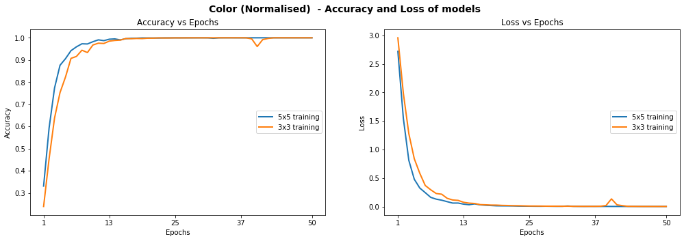
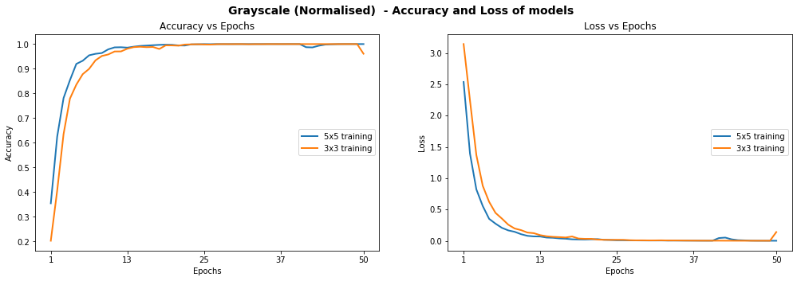
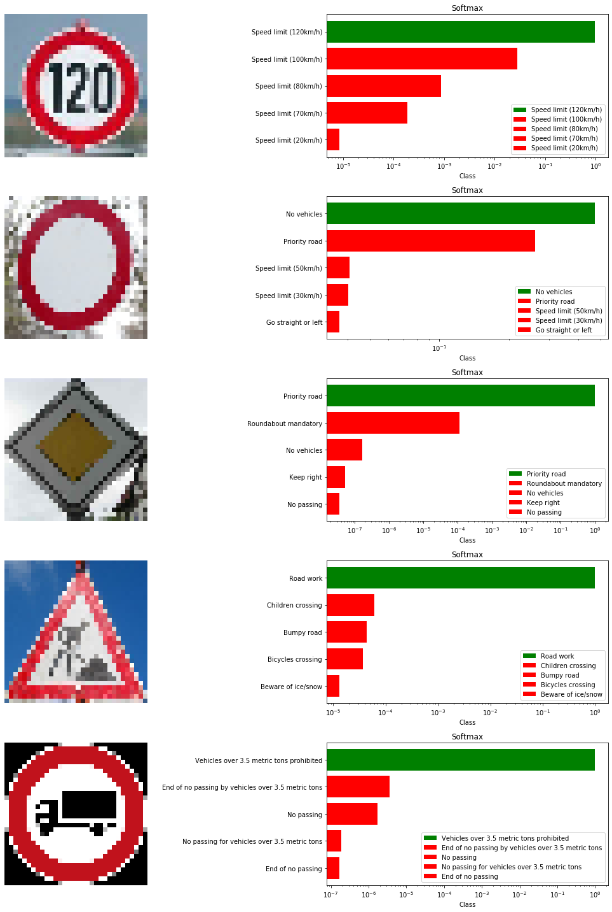

## 道路交通标志识别项目文档
---

一、项目概览
---
交通标志识别能有效地帮助司机们了解道路的关键信息、获取当前的道路状况，从而有效地避免交通事故的发生。同时，交通标志识别技术对于自动驾驶来说也有着非常重要的作用。

使用传统的计算机视觉的方法来对交通标志进行识别并不是不可行的事情，但是需要耗费大量的事件来手工处理图像中的一些重要的特征。如果引入深度学习技术来识别交通标志，则可以大大地减少人工工作量，选择合适的网络结构以及所需的训练参数则可以将识别的准确率大幅度提高。

该项目构建了可以调参的LeNet网络，在德国交通标志数据集[GTSRB](http://benchmark.ini.rub.de/?section=gtsrb&subsection=dataset)上训练进行分类识别。你可以在`Traffic_Sign_Classifier.ipynb`文件中看到数据预处理、网络构建、模型训练以及模型测试的整体流程，也可以自行修改模型参数训练自己的模型。

二、项目配置
---

### 1、开发环境
- Python3.7
- TensorFlow 1.14
- Jupyter notebook

### 2、数据集详情
项目中提供了训练所需要的训练集以及测试集，所有的数据都已经事先使用`pickle`进行了持久化处理。分别储存在`dataset/test.p`以及`dataset/train.p`文件中。

处理之后的图像特征：
- 图像大小为32x32x3（宽高均为32px，RGB三通道彩色图像）
- 训练集由39209张图片构成
- 测试集由12630张图片构成
- 共有43个交通标志种类

### 3、注意事项
* 安装python依赖`imgaug`出错解决方案：

    使用如下代码进行安装：
    ```sh
    pip install imgaug --user
    ```
    错误原因及详情参考地址：
    [http://www.manongjc.com/article/118030.html](http://www.manongjc.com/article/118030.html)

* `TensorFlow`安装请使用如下代码：
    ```sh
    pip install tensorflow==1.14
    ```

三、项目介绍及原理
---
### 1、参考文献
> [LeCun, Yann, et al. “Gradient-based learning applied to document recognition.” Proceedings of the IEEE 86.11 (1998): 2278-2324.](https://ieeexplore.ieee.org/document/726791)

### 2、图像数据及其分布
以下是训练集中几个交通标志类别下的示例图像，从中我们可以看到图像的清晰度、亮度差异很大，需要在数据预处理阶段对图像的对比度进行调整。

下图反应了训练集中各个类别交通标志图像的分布情况，有些种类的数据很多而有些类别的数据则相对较少，这会导致我们的模型会更倾向于选择有较多数据的类别，之后我们会用数据增强来减弱这种影响。


### 3、数据预处理
预处理时使用了两种方法对图像进行预处理：

#### 灰度化
将三通道彩色图像转为单通道灰度图像：

#### 归一化
通过使用数据集的平均值减去每一个图像并且除以数据集的标准偏差来归一化数据集，确定数据集分布的中心，能够提高模型在处理数据时的一致性。


### 4、网络架构
#### Yann LeCun的经典LeNet网络架构
LeNet诞生豫1994年，是最早的卷积神经网络之一。之后，`Yann LeCun`等人在多次研究后提出的LeNet-5，成为最终卷积神经网络结构。一般情况下所说的LeNet即指LeNet-5.

LeNet包含7层，不包括输入，每一层都包含可训练参数（权重），使用的输入数据是32*32像素的图像。

第一层（C1）是具有6个5*5的卷积核的卷积层(convolution)，特征映射的大小为28\*28（32-5+1），这样防止了输入图像的信息掉出卷积核边界。这一层包含156个可训练参数和122 304个链接。

第二层（S2）是输出6个大小为14*14的特征图的子采样图(subsampling/pooling)。每个特征地图中的每个单元连接到C1中的对应特征地图中的2\*2个邻域。S2中单位的四个输入相加，然后乘以可训练系数（权重），然后加到可训练偏差（bias）。结果通过S形函数传递。由于2\*2个感受域不重叠，因此S2中的特征图只有C1中的特征图的一半行数和列数。这一层有12个可训练参数和5880个连接。

第三层（C3）是具有16个5-5的卷积核的卷积层。前六个C3特征图的输入是S2中的三个特征图的每个连续子集，接下来的六个特征图的输入则来自四个连续子集的输入，接下来的三个特征图的输入来自不连续的四个子集。最后，最后一个特征图的输入来自S2所有特征图。这一层有1516个可训练参数和156 000个连接。

第四层（S4）与第二层类似，大小为2\*2，输出为16个5*5的特征图。第四层有32个可训练参数和2000个连接。

第五层（C5）是具有120个大小为5\*5的卷积核的卷积层。每个单元连接到S4的所有16个特征图上的5\*5邻域。这里，因为S4的特征图大小也是5\*5，所以C5的输出大小是1\*1。因此S4和C5之间是完全连接的。C5被标记为卷积层，而不是完全连接的层，是因为如果LeNet-5输入变得更大而其结构保持不变，则其输出大小会大于1*1，即不是完全连接的层了。C5层有48120个可训练连接。

F6层完全连接到C5，输出84张特征图。它有10164个可训练参数。这里84与输出层的设计有关。

Yann LeCun在论文中给出的模型的架构图如下：


#### 本项目中设计的可调参的EditLeNet架构
项目中构建的模型架构基于Yann LeCun的LeNet网络架构做出了一些调整，并且构建了模块化的代码库，允许尝试不同的过滤器大小、深度和卷积层的数量，以及完全连接层的维度。

项目演示中主要使用了3*3和5\*5的过滤器，卷积层的深度从32开始，使用3\*3过滤器时的网络架构如下：


模型有3个卷积层，过滤器大小为3*3，下一层的深度加倍，使用`ReLU`函数作为激活函数，每一层之后是2\*2的最大化池操作。最后3层完全链接，最后一层可以产生43个结果，代表着数据集中43种交通标志。模型使用有`SoftMax`激活函数，`Adam`优化器的迷你批次随机梯度下降算法。

#### 模型创建方法
使用如下代码创建模型：
```sh
mc_3x3 = ModelConfig(EditLeNet, "EditNet_Grayscale_3x3", [32, 32, 1], [3, 32, 3], [120, 84], n_classes, [1.0, 1.0])
mc_5x5 = ModelConfig(EditLeNet, "EditNet_Grayscale_5x5", [32, 32, 1], [5, 32, 2], [120, 84], n_classes, [1.0, 1.0])
```
`ModelConfig`包含了模型的基本信息：
- 模型的函数
- 模型的名称
- 图像数据输入格式（Ex：灰度图像的输入格式为[32, 32, 1]）
- 卷积层的配置（[过滤器的大小, 起始深度, 层数]）
- 完全连接层的大小（Ex：[120, 84]）
- 数据种类的数量（在本项目中为43）
- dropout的百分比值[p-conv, p-fc]

`ModelExecutor`包含训练、评估、预测以及生成数据可视化效果的函数

使用下面的结构来为每个创建的模型创建单独的TesnsorFlow图，从而保证运算的高效性以及确保运算时没有混入变量、占位符：
```sh
self.graph = tf.Graph()
with self.graph.as_default() as g:
    with g.name_scope( self.model_config.name ) as scope:
...
with tf.Session(graph = self.graph) as sess:
```

### 5、训练过程
项目已经针对标准的彩色图像、灰度图像和归一化之后彩色图像、灰度图像进行了模型训练，并且得到了在不同情况下的模型的损失率和准确率的图像。可以看到灰度图像的结果通常都要好于彩色图像:
- 未归一化的彩色图像训练结果 

- 未归一化的灰度图像训练结果

- 归一化的彩色图像训练结果

- 归一化的灰度图像训练结果


### 6、模型优化
#### Dropout算法
Dropout算法是指在深度学习网络的训练过程中对于神经网络单元，按照一定的概率将其暂时从网络中丢弃。这样可以防止模型因为训练参数过多、训练数据过少而引起的过度拟合。

Dropout算法由Geoffrey Hinton提出来，参考论文如下：
>[N. Srivastava et al. "Dropout: A simple way to prevent neural networks from overfitting (2014)" ](http://jmlr.org/papers/volume15/srivastava14a/srivastava14a.pdf)

本项目中采取类似于原作者根据层类型的不同应用不同的概率值进行丢弃的方法，定义了两个级别的dropout：
- p-conv：应用于卷积层的丢弃概率
- p-fc：应用于全连接层的丢弃概率

经过一些测试，最终发现，当最终结果是`p-conv = 0.75`和`p-fc = 0.5`的时候，使用5*5的过滤器的模型可以在归一化之后的灰度图像上达到94.62%的测试集概率：


四、新图像预测
---
在上述过程中，每次训练之后得到的模型均已经保存在`models`文件夹下面，我们选择表现最好的模型`EditLeNet_Norm_Grayscale_3x3_Dropout_0.50`，用其对数据集之外的交通标志图像进行识别预测。

使用的5个新的用来预测的交通标志图如下：


将它们转为灰度图：


使用如下代码进行预测：
```sh
# 导入图像
new_imgs_dir = "./predictions/"
new_imgs = get_imgs_from_folder(new_imgs_dir)
new_imgs.shape

# 转为灰度图像
clahe = cv2.createCLAHE(tileGridSize=(4,4), clipLimit=40.0)
new_img_grayscale= np.asarray(list(map(lambda img: clahe.apply(to_grayscale(img)), new_imgs)))

# 将灰度图像归一化
new_img_grayscale_normalised = normalise_images(new_img_grayscale, X_train_grayscale)

# 图像数据转化为tensorflow的数据格式
new_img_grayscale_normalised = np.reshape(new_img_grayscale_normalised, (new_img_grayscale_normalised.shape[0], 32, 32, 1))

# 预测
preds = me_gray_norm_drpt_50_3x3.predict(new_img_grayscale_normalised)
```
最终可以看到模型的预测准确率（100%）还是非常高的，以下是在各个图像上的预测情况：
